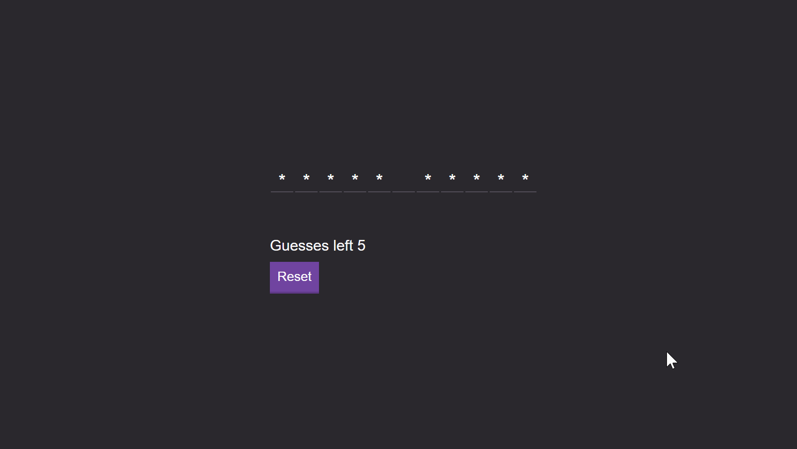

# Dynamic JavaScript Game HangMan

A Dynamic Game was developed in Javascript, in order to learn and understand the backend logic of a web app language - Originally developed 18/11/2019

# [Responsive Website Click](https://drea.netlify.app/)

## What was developed in this project
Amazing experience building: 
1. The backend of the website
2. Collecting the words from a simple API
3. Creating the logic restrictions of the game
4. Keyboard collection of information
5. Building the Frontend of the app

## Results of the Project 

Winning Game

Losing Game 

## Technology Used 
- JavaScript
- CSS
- HTML
