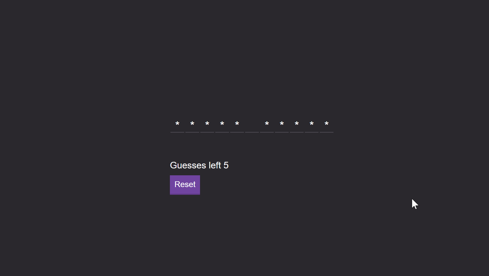

# Image Processing Masks-Convolution

A Dynamic Game was developed in Javascript in order to learn and understand the backend logic of a web app language - Originally developed 18/11/2019

## In this project it was developed 
Amazing experience building 
1. The backend of the website
2. collecting the words from a simple API
3. Creating the logic restrictions of the game
4. Keyboard collection of information
5. Building the Front end of the app

## Results of the Project 
Winning Game

Losing Game 

## Technology Used 
- JavaScript
- CSS
- HTML
